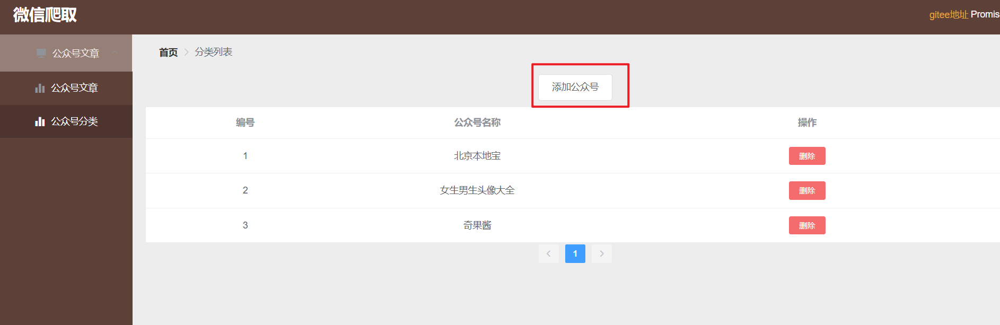
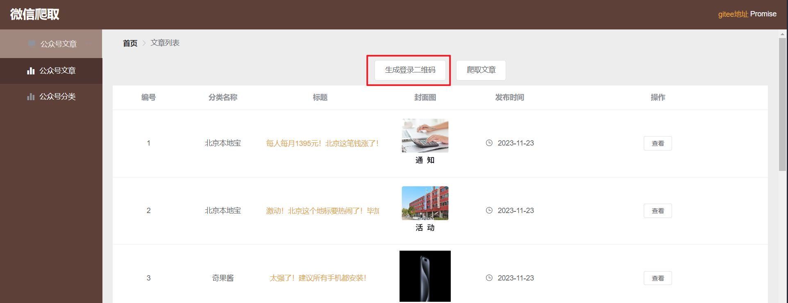
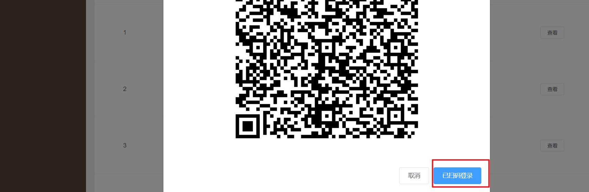
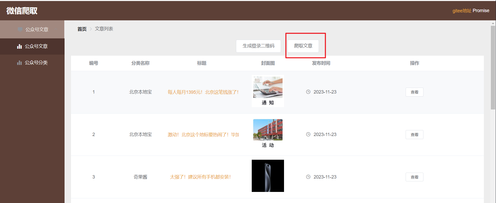
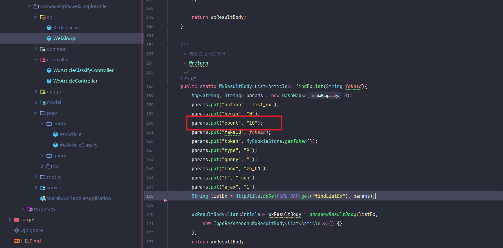

# 根据微信公众号名称爬取文章

#### 介绍
一个可以通过微信公众号登录，来一键爬取公众号文章的小工具

项目参考：https://gitee.com/iszsq/sq-weixin-api-demo

在该项目基础上完成cookie在redis上的持久化

该项目只爬取到公众号的文章标题，并未爬取文章内容，在原本基础上完成了文章的爬取

将该项目做成springboot项目，方便直接放入项目中做定时任务等

#### 软件架构
springboot+mybatis-plus+mysql+redis

#### 使用说明
1.  修改数据库地址
2.  修改redis地址
3.  前端使用npm run serve直接启动即可（不是很会前端，用的时候需要手动全局改一下里面调用接口的地址）
4.  在这里添加公众号

5.  先在这里生成二维码登录（需要有一个微信公众号，搜一下如何注册，比较简单）

6.  根据提示点击已扫码登录后，点击爬取文章即可爬取分类中设置公众号文章

    
7.  爬取文章数可以在这里设置

#### 注：使用该开源程序爬取出现任何法律问题与本人无关，本人不承担任何法律责任

